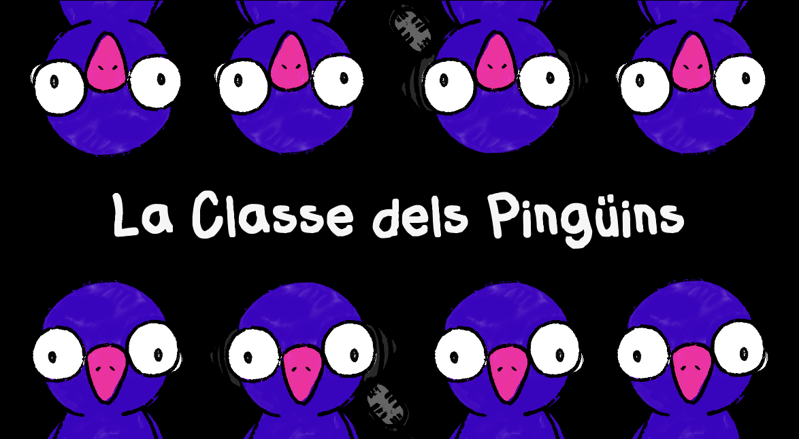
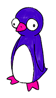
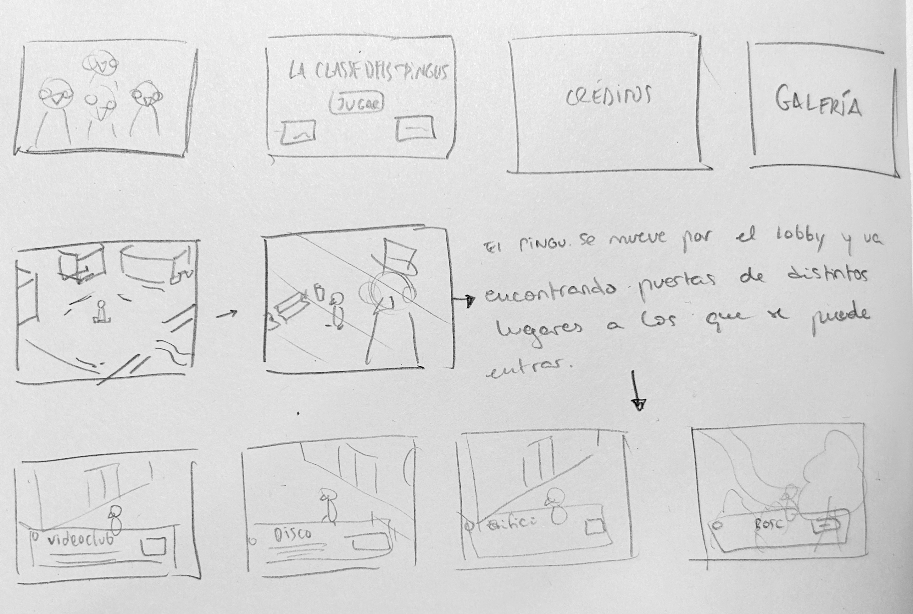
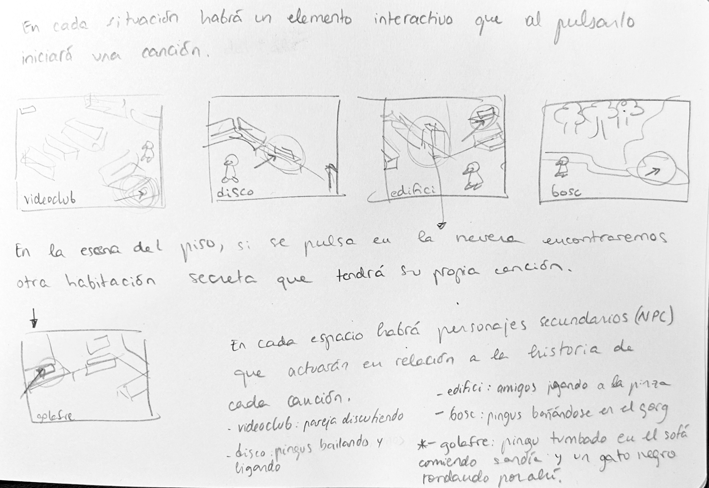
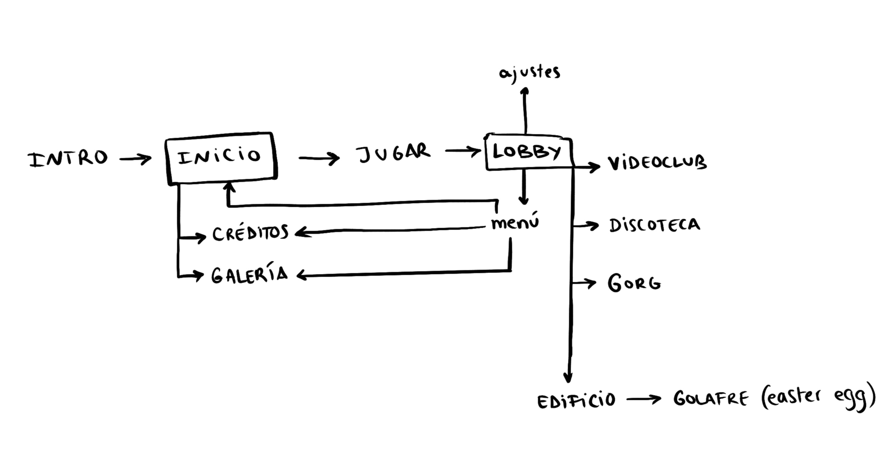
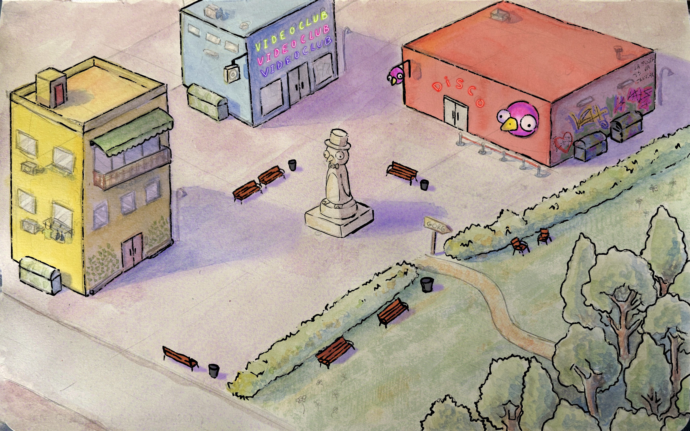

## La Classe dels Pingüins-EP Vall Fosca

Proyecto de Creación Multimedia Interactiva de la Facultad de Bellas Artes de la Univesidad de Granada

# 1 Datos 

**Titulo** : La Classe dels Pingüins-EP Vall Fosca

**Web:**   https://annamallol.itch.io/la-classe-dels-pinguins

**Autor:**  Anna Mallol García

**Resumen** : Este proyecto consiste en la búsqueda de las canciones del EP del grupo catalán La Classe dels Pingüins. El personaje principal es un pingüino que llega a un pueblo y mientras va explorando puede encontrar diversas canciones, las cuales están repartidas por todo el juego.

**Estilo/género:**  Juego

**Logotipo** : 

**Resolución:** 114x200px 

**Probado en:**   Google Chrome, Safari.

**Tamaño proyecto:** 136,7 MB 

**Licencia** Este proyecto tiene una Licencia CC Reconocimiento Compartir igual (CC BY-SA)

**Fecha** : 28/05/2026

# 2. Memoria del proyecto 

### 2.1 Storyboard: 

En el proyecto hay un personaje que explora un mapa que se divide en cinco espacios; la plaza principal, un edificio residencial, un videoclub, una discoteca y un bosque. El personaje puede moverse por la plaza principal y puede entrar a cada espacio para explorarlo. En cada espacio puede encontrar canciones que están escondidas en uno de los objetos de cada habitación. La idea general es que el usuario pueda escuchar las canciones y disfrutarlas a la vez que explora cada espacio. En cada una de las localizaciones ocurrirán situaciones concretas que representan el concepto de cada canción.

### 2.2. Esquema de navegación 

# 3. Metodología

## Etapa 1: Ideación de proyecto

**Investigación de campo**

**Motivación de la propuesta** 

Este  proyecto lo realicé para crear 

**Publico / audiencia**

- Orientado a un público adolescente/adulto

## Etapa 2: Desarrollo / actividades realizadas

He planteado el proyecto como un espacio interactivo con botones que permiten moverse entre espacios. Para las instrucciones, he planteado un pequeño tutorial en formato video al cual se puede acceder desde un botón que aparece en la plaza principal del juego. Para las canciones que hay que encontrar he usado botones camuflados con los objetos de cada espacio; cuando se pulsa el botón, aparece un panel donde se puede activar, desactivar y seleccionar el segundo que se quiere reproducir.

## Etapa 3: Problemas identificados

He tenido muchos problemas para poner el vídeo. Cuando conseguí ponerlo, funcionaba perfectamente y de repente el programa se colgó. Al volver a cargar Godot, el proyecto se abría pero no cargaba la escena en la que estuve trabajando. Lo intenté solucionar, pero la lié más porque eliminé una carpeta que no era y perdí todo el progreso de dos semanas de trabajo. Creo que el vídeo fue el principal detonante, porque supongo que al intentar redimensionarlo el programa no lo entendió y se quedó colgado.

# 4. Conclusiones 

Durante el proceso de trabajo me lo he pasado bien, y aunque haya tenido algunos problemas con el programa creo que he aprendido mucho y me gustaría continuar el proyecto por mi cuenta. 

# 5 Referencias 

**Recursos y materiales audiovisuales:**

* Musica: música propia de mi grupo "La Classe dels Pingüins"
* Imágenes: imágenes dibujadas por mí  
* Tipografía: "Flabby Bums handwriting" y "Righty uses left hand"

**Herramientas utilizadas**

- Godot Engine 4.6
- Adobe Photoshop 2026
- Adobe Illustrator 2026
- Procreate

(imagen de la licencia, copiar y pegar aquí la correcta)
https://creativecommons.org/licenses/?lang=es

* logos en https://creativecommons.org/mission/downloads/
  
  </small>

Mayo 202X
